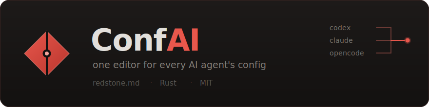

<p align="center">
  
</p>

<p align="center">
  <a href="https://github.com/redstone-md/ConfAI/actions/workflows/ci.yml"></a>
  
  
</p>

<p align="center">
  <a href="https://redstone.md">redstone.md</a> ·
  <a href="https://github.com/redstone-md/ConfAI">ソース</a> ·
  <a href="../CONTRIBUTING.md">コントリビュート</a> ·
  <a href="../LICENSE">MIT</a>
</p>

<p align="center">
  <a href="../README.md">English</a> ·
  <a href="README.ru.md">Русский</a> ·
  <a href="README.zh-CN.md">简体中文</a> ·
  <a href="README.es.md">Español</a> ·
  <a href="README.de.md">Deutsch</a> ·
  <b>日本語</b>
</p>

---

Codex、Claude Code、opencode は、それぞれ別のファイルに、別の形式で、同じ概念に別
の名前を付けてエンドポイントを保持しています。プロバイダを一つ追加する、あるいは二
つの間で切り替えるだけで、三つのファイルを手で開くことになります。ConfAI はそれを
一つのコマンドで行い、変更していない箇所を整形し直すことは決してありません。

## インストール

Linux と macOS:

```sh
curl -fsSL https://github.com/redstone-md/ConfAI/releases/latest/download/install.sh | sh
```

Windows:

```powershell
irm https://github.com/redstone-md/ConfAI/releases/latest/download/install.ps1 | iex
```

どちらのスクリプトもプラットフォームを判定し、対応するリリースアーカイブと
`SHA256SUMS` をダウンロードし、チェックサムを検証してから、はじめてバイナリを配置し
ます。インターネット上のスクリプトをシェルにパイプするかどうかは信頼の判断であり、
決めるのはあなたです。先に中身を読む手順は [INSTALL.md](../INSTALL.md) にあります。

cargo からは、crate が crates.io に公開されてから使えます。v0.0.1 の時点では未公開
のため、次の二つはまだ動きません:

```sh
cargo install confai --locked    # ソースからビルド。Rust 1.88+ が必要
cargo binstall confai            # ビルドせずリリースアーカイブを取得
```

手動で入れる場合は、
[リリースページ](https://github.com/redstone-md/ConfAI/releases/latest)から自分の
ターゲット向けのアーカイブを取得し、併せて公開されている `SHA256SUMS` と突き合わせ
て検証し、バイナリを `PATH` に置いてください。

残りは [INSTALL.md](../INSTALL.md) にあります。対応ターゲット一覧、インストーラのオ
プション、`PATH` の扱い、アンインストールの方法です。

## 何をするツールか

```
$ confai list
agent        detected         providers  active  model          config
Codex        binary + config  3          primary gpt-5.6-terra  ~/.codex/config.toml
Claude Code  binary + config  1          byesu   opus[1m]       ~/.claude/settings.json
opencode     binary + config  11         vendor              ~/.config/opencode/opencode.json
```

- 一つのコマンドで、そのエンドポイントを持つすべてのエージェントを切り替えます:
  `confai provider use primary`。
- 一つのプリセットで、同じエンドポイントをすべてに書き込みます:
  `confai preset apply byesu --all --use`。
- `confai provider sync` は、エンドポイントが実際に提供しているモデル一覧を、コンテ
  キスト長と出力上限つきで書き込みます。
- コメント、キーの順序、未知のキーは編集後も残ります。書き込みの前には必ずバック
  アップが取られ、`confai undo` で元に戻せます。

引数なしで `confai` を実行すると、二ペインのブラウザが開きます。左がエージェント、
右がそのエージェントのエンドポイントです。

<p align="center">
  
</p>

<details>
<summary><b>コマンドライン</b> — サブコマンドとオプションの一覧</summary>

```sh
confai                                    # 対話画面
confai list                               # 何が入っていて、設定はどこか
confai provider list --check              # 全エンドポイントと、応答するかどうか
confai provider add byesu \
    --agent codex \
    --base-url https://byesu.com/v1 \
    --api-key "$BYESU_API_KEY" \
    --wire-api chat --use
confai provider use primary               # それを持つ全エージェントを切り替える
confai provider sync vendor --prune       # エンドポイントからモデル一覧を取得
confai preset apply byesu --all --use     # 一つのエンドポイントを全エージェントへ
confai doctor                             # まだすべて解析でき、解決できるか
confai undo                               # 直前の状態に戻す
```

`--agent` は一つのエージェントを、`--all` はインストール済みのすべてを対象にしま
す。どちらも指定しない場合、読み取り系コマンドはすべてを対象にし、書き込み系コマン
ドは選択を求めます。

| コマンド | |
|---|---|
| `list` | どのエージェントが入っていて、何を向いているか |
| `provider list` | 選択したエージェントのエンドポイント。`--check` で各所に問い合わせ |
| `provider add <id>` | エンドポイントを追加、または既存のものに渡したフィールドを反映 |
| `provider remove <id>` | エンドポイントを削除 |
| `provider use <id>` | エージェントをそのエンドポイント経由にする |
| `provider check [id]` | エンドポイントが生きているか、何を提供しているかを問い合わせ |
| `provider models [id]` | エンドポイントが提供するモデル。上限と価格つき |
| `provider sync <id>` | モデル一覧を設定に書き込む |
| `preset list` · `preset show <id>` | どんなプリセットがあるか · それが何を書き込むか |
| `preset apply <id>` | プリセットのエンドポイントを選択したエージェントに書き込む |
| `model [model]` | エージェントが使うモデルの表示・設定 |
| `path` · `edit` | 設定ファイルのパスを表示 · `$EDITOR` で開く |
| `doctor` | すべての設定が解析でき、参照先のプロバイダが解決できるか確認 |
| `about` · `update` | バージョンと状態の保存先 · 新しいリリースの有無 |
| `undo` | 直前の書き込み前にバックアップした設定を復元 |

`provider add` は `--base-url`、`--api-key`、`--wire-api`（`chat`、`responses`、
`anthropic`）、`--name`、バックエンド固有のキー用に繰り返し指定できる
`--set KEY=VALUE`、そして書き込み後にそのエンドポイントを選択しモデルを取得する
`--use` / `--sync` を取ります。`provider check` は秒単位の `--timeout`（既定 10）
を取ります。`provider models` は `--select <model>` と `--refresh` を、
`provider sync` は `--prune`、`--dry-run`、`--refresh` を、`preset apply` は
`--api-key`、`--use`、`--sync` を取ります。

`list`、`doctor`、`about`、`update`、`preset list` はエージェント指定を取りませ
ん。常にすべてを対象にします。

</details>

<details>
<summary><b>対話画面</b> — コマンドパレット、詳細表示、キー割り当ての全一覧</summary>

`Ctrl+P` のコマンドパレットは、すべての操作をそれを実行するキーとともに一覧表示しま
す。ショートカットはこのページを読んで覚えるものではなく、使いながら覚えるもので
す:

<p align="center">
  
</p>

エンドポイント上で `Enter` を押すと、記録されている情報がすべて表示されます。コンテ
キスト長と出力上限つきのモデル一覧も含まれます:

<p align="center">
  
</p>

| キー | |
|---|---|
| `Ctrl+P` / `Ctrl+K` | コマンドパレット — すべての操作を検索可能 |
| `↑` `↓` / `k` `j` | 移動 · `Tab` `←` `→` ペイン切り替え |
| `Enter` | エンドポイントの詳細（モデル一覧を含む） |
| `/` または `Ctrl+F` | id・ホスト・モデルでエンドポイントを絞り込み |
| `u` | このエージェントを選択中のエンドポイント経由にする |
| `m` | このエージェントが使うモデルを選ぶ |
| `a` `e` `d` | 追加 · 編集 · 削除 |
| `c` / `C` | このエンドポイントを確認 · すべて確認 |
| `s` / `S` | モデルを同期 · 同期して古いものを削除 |
| `p` | プリセットを適用 |
| `?` | このツールについてと、キー割り当ての全一覧 |
| `r` `q` | ディスクから再読み込み · 終了 |

マウスも使えます。クリックで選択、もう一度クリックで開く、ホイールでスクロール、ヒ
ントをクリックでその操作を実行します。

キーは物理的な位置で判定されるため、非ラテン配列でもそのまま動きます。`й` は `q`、
`Ы` は `S` です。`/` はキリル配列に対応する位置がないため、`Ctrl+F` でも絞り込みが
開きます。

編集は CLI と同じ「読み込み・変更・保存」の経路を通るので、ファイルに関する保証も同
じように成り立ちます。

</details>

<details>
<summary><b>ファイルに対してしないこと</b> — コメント、キーの順序、バックアップ</summary>

設定ファイルは人が手で書くものであり、手書きのファイルには、素朴な読み書きの往復で
壊れてしまうものが入っています。

- **コメントは残ります。** Codex の設定は `toml_edit` を通して編集されるため、コメ
  ントアウトされた `base_url` に待避させておいた予備のエンドポイントも、編集後にそ
  のまま残ります。
- **変えたところだけが変わります。** キーの順序、インデント、未知のキーはそのままで
  す。どのバックエンドも、自分なりのファイル像を再シリアライズし直すのではなく、解
  析済みの文書をその場で編集するからです。
- **コメント付きの JSON は壊さず拒否します。** ConfAI はコメントを捨てるほかなく、
  だから処理を止めてそう伝えます。
- **書き込みの前には必ずバックアップ**を、元のファイルの隣に `<name>.confai.bak` と
  いう名前で作り、ファイルはアトミックに置き換えます。`confai undo` で復元できま
  す。

</details>

<details>
<summary><b>モデルと死活確認</b> — モデル一覧の取得元と、--prune の働き</summary>

opencode は教えられていないモデルを候補に出しませんし、コンテキスト長が明示されてい
ることを求めます。`confai provider sync <id>` はエンドポイントの `/v1/models` を呼
び、各 id を [models.dev](https://models.dev) で調べてコンテキスト長と出力上限を取
得し、その結果を書き込みます。`variants` をはじめ、あなたが設定した他の項目には触れ
ません。カタログは一日キャッシュされ、`--refresh` で再取得します。

同期はマージなので、ゲートウェイ側ですでに廃止されたモデルも、あなたが指示するまで
設定に残ります。`--prune` はエンドポイントがもう提供していないものを削除し、選択中
のモデルを削除した場合は、残ったモデルへ選択を移します:

```sh
confai provider sync vendor --prune --dry-run   # 何が消えるか確認する
confai provider sync vendor --prune
```

対話画面では `s` が同期、`S` が削除つきの同期です。

`confai provider models <id>` は何も書き込まずにエンドポイントの提供モデルを一覧表
示し、`--select` でそのうち一つをエージェントのモデルにします。これは、モデルは記録
するがモデル一覧は持たない Codex と Claude Code でも動きます。

`confai provider check` は書き込みを伴わない同じ呼び出しです。各エンドポイントが応
答するか、どれくらいの速さで返ったか、いくつのモデルを提供しているかを報告します。

</details>

<details>
<summary><b>プリセット</b> — 一つのエンドポイント定義を、どのエージェントにも</summary>

プリセットとは、一つのエンドポイントをエージェントに依存しない形で一度だけ記述した
もので、同じ定義をどのエージェントにも適用できます:

```sh
confai preset list
confai preset show byesu
confai preset apply byesu --all --api-key sk-... --use --sync
```

組み込みのプリセット 26 個は [`presets/`](../presets/) にあり、それぞれ TOML ファイ
ル一つとして、ビルド時にバイナリへ埋め込まれます。OpenCode Zen、OpenRouter、
OpenAI、Anthropic、Groq、xAI、Mistral、Cerebras、Together、DeepSeek、DeepInfra、
Fireworks、Moonshot、Z.ai、Chutes、Baseten、Vercel AI Gateway、Venice、Novita、
Byesu、Ollama、LM Studio に対応しています。追加は、新しいファイル一つだけを触るプ
ルリクエストで済みます。自分用のプリセットは `~/.confai/presets/` に置き、同じ id
の組み込みプリセットを上書きします。

</details>

<details>
<summary><b>エージェント</b> — 三つの設定の形と、ConfAI のそれぞれへの対応</summary>

| エージェント | 設定ファイル | キー | 名前付きプロバイダ | モデル一覧 | 切り替え |
|---|---|---|---|---|---|
| Codex | `~/.codex/config.toml` | 同じファイル | あり | なし | `model_provider` |
| Claude Code | `~/.claude/settings.json` | `env` ブロック | ConfAI 経由 | なし | `ANTHROPIC_*` |
| opencode | `~/.config/opencode/opencode.json` | `~/.local/share/opencode/auth.json` | あり | あり | `provider/model` |

`CODEX_HOME`、`CLAUDE_CONFIG_DIR`、`OPENCODE_CONFIG`、`XDG_CONFIG_HOME` は、エー
ジェント自身がそうするのと同じように尊重されます。

Claude Code は自分の設定内の環境変数を通して、一度に一つのエンドポイントだけを指し
ます。使っていないエンドポイントを置いておく場所がありません。ConfAI はその一覧を
`~/.confai/agents/claude.json` に保持し、Claude Code が所有するファイルには選択中の
項目だけを書き込みます。

opencode は二つのファイルに分かれています。プロバイダは `opencode.json`、キーは
`opencode auth login` が書き込む `~/.local/share/opencode/auth.json` です。ConfAI は
両方を読むので、死活確認は opencode が実際に使う資格情報で行われ、誤った 401 を報告
することがありません。新しいキーは `auth.json` に書き込みます。すでに
`opencode.json` の中に直接書かれているキーは、その場で更新します。秘密情報を黙って
別のファイルへ移すのは、それ自体が驚きだからです。`auth.json` の OAuth セッションは
表示しますが、決して上書きしません。黙って終了させる代わりに、
`opencode auth logout` を実行するよう伝えます。

エージェントの追加は、`Agent` と `AgentConfig` を実装した `src/agent/` のファイル一
つです。その層より上は、どのエージェントを相手にしているかを知りません。

</details>

<details>
<summary><b>最新の状態を保つ</b> — 更新確認の仕組みと、無効にする方法</summary>

`confai update` は、新しいリリースがあるかを報告し、変更点を要約し、更新方法を表示
します。

普段は自分から尋ねる必要はありません。コマンドの実行後、新しいリリースが出ていれば
ConfAI が stderr に二行の通知を出します:

```
◆ 0.0.1 → 0.0.2 available
  · provider sync now prunes retired models
  · run `confai update` for the rest
```

この通知は一日に一度までしか確認しないキャッシュから描かれるので、通常の実行には何
のコストもかかりません。キャッシュが古い場合、確認には 400 ミリ秒の猶予が与えられ、
それを過ぎれば実行はあきらめて翌日に回します。確認に失敗したときは、呼び出しのたび
に再試行するのではなく一時間待ちます。`CONFAI_NO_UPDATE_CHECK` を設定すれば、まるご
と無効にできます。

ConfAI は自分自身のバイナリを置き換えません。`cargo` とインストーラがすでにそれを適
切に行っていますし、あなたの資格情報を握ったまま自分自身を書き換えるツールは、一行
を表示するより割の悪い取引です。

</details>

<details>
<summary><b>コントリビュート</b> — プリセットやエージェントを追加する</summary>

プリセットは `presets/` に新しいファイルを一つ。新しいエージェントは、`Agent` と
`AgentConfig` を実装した `src/agent/` の新しいファイルを一つで、その上の層はそのま
まです。プルリクエストを出す前に `cargo test` と
`cargo clippy --lib --bins --tests` を実行してください。
[CONTRIBUTING.md](../CONTRIBUTING.md) も参照してください。

</details>

## ライセンス

[MIT](../LICENSE) © [redstone.md](https://redstone.md)
